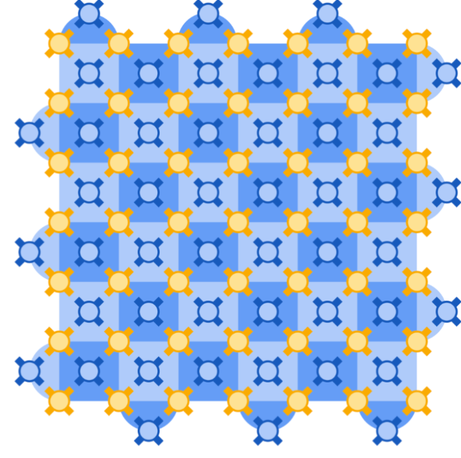

# Distance-7 Rotated Surface Code 

## WORK IN PROGRESS

## Notebook prototype for the initial model of the rotated surface code I am building for a 7x7 Willow chip

## The relevant theory related to the rotated surface code can be found at:
* https://arxiv.org/pdf/1208.0928
* https://arxiv.org/pdf/2409.14765

## The code works as follows:
1. All X-type stabilizers (both plaquette and weight-2 edges) and Z-type are measured
2. X error is applied to each qubit with a reasonable error rate (1.4%)
3. Stabilizer measurements are taken repeatedly to build a detector graph
4. The logical qubit Z_L is measured
5. A minimum weight perfect matching solution is found for the graph and used to decode the measured Z_L values
6. All results and the detector graph are displayed

